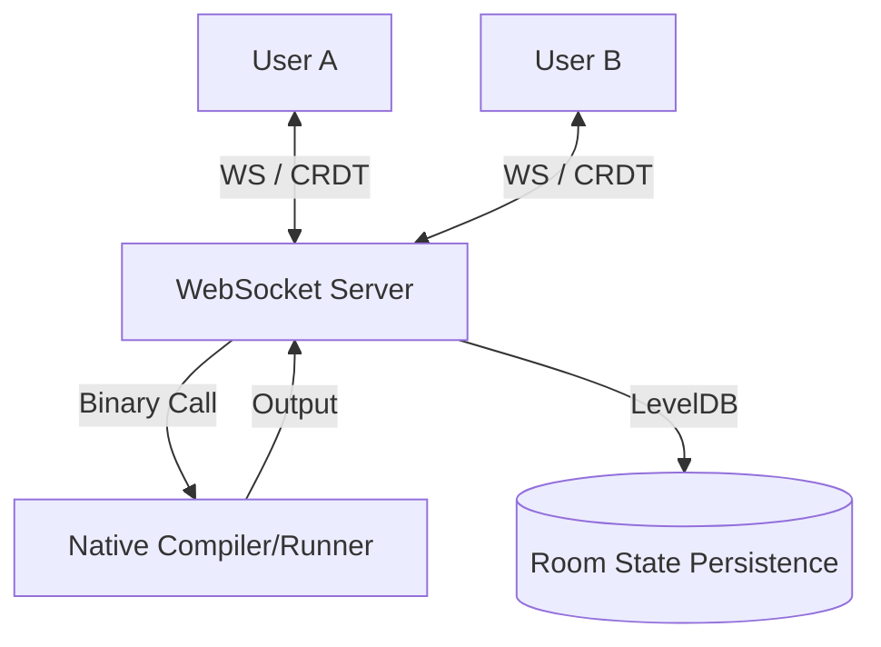
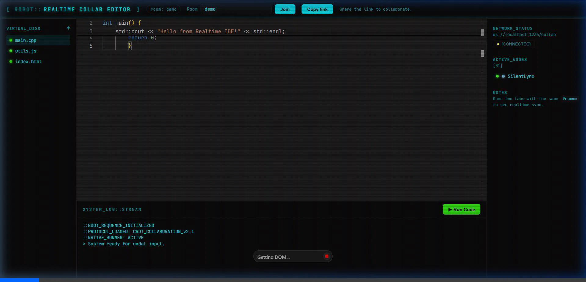

# Real-Time Collaborative IDE (High-Performance Monorepo)

A professional-grade, low-latency collaborative code editor designed for technical interviews, pair programming, and remote collaboration. This project demonstrates advanced distributed systems architecture, infrastructure-as-code, and premium frontend engineering.

## Core Pillars

- **CRDT-Based Collaboration**: Implements Yjs for conflict-free replicated data types. This architecture replaces centralized document locking with mathematically guaranteed eventual consistency.
- **Native Multi-Language Execution**: A custom backend engine that leverages local system binaries (g++, python, node) to execute code with near-zero overhead.
- **Hierarchical Virtual File System (VFS)**: A real-time synchronized project explorer allowing teams to manage complex project architectures dynamically.
- **Infrastructure-as-Code**: Fully containerized using multi-stage Docker builds and orchestrated with Docker Compose for enterprise-grade deployment.
- **CI/CD Integrity**: Automated testing and quality assurance pipelines via GitHub Actions ensuring code reliability on every commit.

## Technology Stack

| Layer | Technology |
|---|---|
| Frontend | React 18, TypeScript, Monaco Editor (VS Code Engine) |
| Real-time Engine | Yjs, y-websocket, Awareness Protocol |
| Backend | Node.js, Express, WebSocket (RFC 6455) |
| Execution | Native System Toolchains (GCC, Python3, Node) |
| Infrastructure | Docker, Nginx (Reverse Proxy), GitHub Actions |

## Getting Started

### 1. Local Development
```bash
# Install workspace-aware dependencies
npm install

# Start both backend and frontend concurrently
npm run dev
```
- Web: http://localhost:5173
- API: http://localhost:1234
- Health: http://localhost:1234/healthz (Returns {"ok":true} when operational)

### 2. Production Deployment (Docker)
```bash
docker-compose up --build
```
This launches the production stack:
- Port 5173: Nginx serving the optimized React application.
- Port 1234: High-concurrency WebSocket server and execution API.
- Volumes: Room state is persisted to LevelDB in the .yjs-data directory.

## Testing and Quality Assurance
```bash
# Run unit and integration tests
npm test

# Verify code style and linting
npm run lint
```

## Architecture



## System Review



The Real-Time Collaborative IDE represents a robust fusion of modern web technologies and low-level system execution. By leveraging CRDTs for synchronization, the system achieves eventual consistency without the overhead of centralized locking mechanisms. The integration of native system compilers directly into the WebSocket relay workflow provides a near-native development experience in a purely browser-based environment. This project stands as a high-performance blueprint for scalable, stateful collaborative applications.


---
*Developed with precision for high-performance collaborative engineering.*
