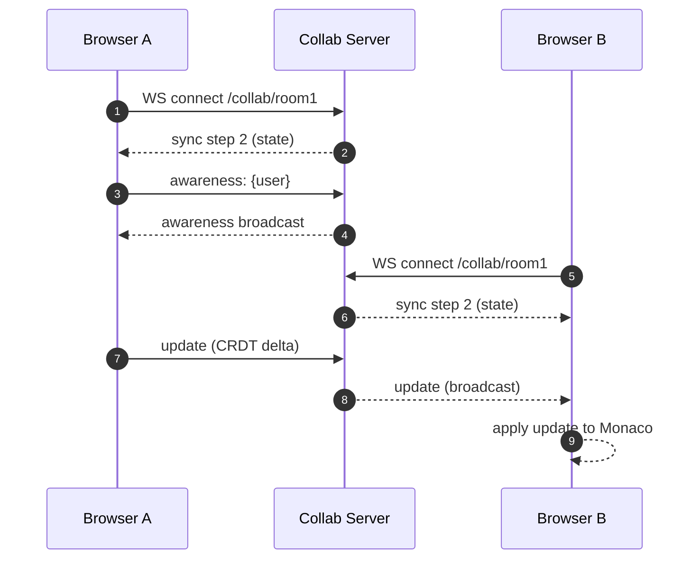

# Architecture

This project is a real-time collaborative code editor built around a CRDT (Yjs) shared document.

## 1. Systematic Overview
The architecture is designed to be decentralized and eventual-consistent. It avoids central conflict resolution by using commutative operations that converge to the same state across all nodes.

### Key Decisions
- **CRDT over OT**: avoids central conflict resolution; converges under concurrent edits.
- **WebSockets**: low-latency bi-directional sync for updates + presence.
- **Room-based collaboration**: each `roomId` maps to one Yjs doc on the server.
- **Server-side persistence (LevelDB)**: documents survive restarts.

## 2. Components

### Web app (`apps/web`)
**Responsibilities**
- Render Monaco editor and manage Virtual File System (VFS).
- Bind Monaco model ⇄ Yjs shared text (CRDT).
- Connect to collaboration backend via `y-websocket`.
- Show presence (online list) and typing indicators via Yjs Awareness.

**Key modules**
- `CollaborativeEditor`: The core component managing lifehooks for Yjs, Monaco, and WebSocket providers.

### Collaboration server (`packages/server`)
**Responsibilities**
- Accept WebSocket connections and route them to room-specific docs.
- Broadcast binary CRDT updates + awareness to all clients in the same room.
- Persist updates via LevelDB.
- **Native Execution API**: A separate endpoint for running code locally using child processes.

## 3. Data Flow

### Connection & Sync
1. Browser parses `?room=<roomId>`.
2. Browser creates a `Y.Doc`.
3. Browser creates a `WebsocketProvider(serverUrl, roomId, ydoc)`.
4. Provider opens WS: `GET ws://<host>/<wsPath>/<roomId>`.
5. Server and client exchange sync messages to reach document state convergence.

### Real-time Editing
1. User types in Monaco → Monaco model emits changes.
2. `y-monaco` turns changes into CRDT operations on `Y.Text`.
3. Provider sends binary updates over WS.
4. Server broadcasts updates to other clients.
5. Other clients apply updates → Monaco reflects changes instantly.

### Presence (Awareness)
1. Client sets local state (e.g., `{ name, color, isTyping }`).
2. Provider broadcasts this state via the Awareness protocol.
3. Peers update their UI (online list, remote cursors, typing tags) based on received states.

## 4. Interaction Model

